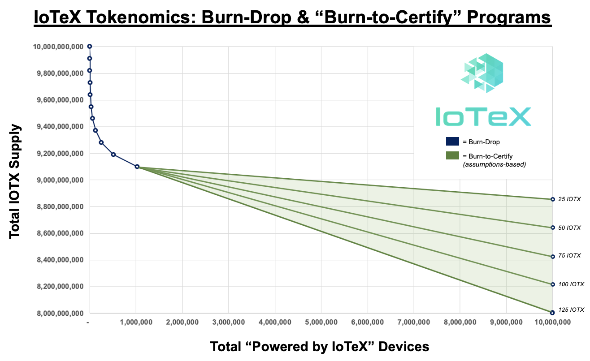

I started looking into IoTeX today, and am sticking my findings here.

There were a few categories of information I was looking for while I was reading through their website / documentation:
1. Is it developed by a central company?
2. Is the code open source, and is it Ethereum based?
3. Is it proof-of-stake, and if so, how does staking work?
4. Is it meant to be a utility, or does it aim to be an asset for investment?
5. Does it have security audits?

# Is it developed by a company?

**Mmmmmm... sorta...**

>"**In the future, all IoTeX stakeholders will have the ability to evangelize and implement their ideas without requiring permission from the IoTeX Foundation** or anyone else — a truly open ecosystem where the best ideas win! Transitioning from a Foundation-led to a community-owned network will remove any single points of failure and allow IoTeX to evolve safely, rapidly, and collectively."

It looks like there's a central IoTeX Foundation, which is similar to Ethereum I suppose. But, seems like the stated goal is the right direction. We'll see if it actually gets there.

>"IoTeX is a decentralized ecosystem that is not owned or governed by any single entity. To facilitate decentralized governance, all IOTX holders are able to stake (“deposit”) their IOTX in order to elect Delegates and participate in network-wide votes." — [IOTX Utility - Network Governance](https://onboard.iotex.io/tokenomics/iotx-utility)

The existence of the IoTeX Foundation seems to be at odds with this.

>"If enough stakeholders vote and the majority of votes are in favor, the proposal will be confirmed and actioned by the IoTeX Foundation and developer groups." — [Decentralized Governance of the IoTeX Network](https://iotex.medium.com/decentralized-governance-of-the-iotex-network-35164d5605ea)

## Delegates

The concept of delegates is interesting. It seems to be another name for a machine running the application.

>"IoTeX uses [Roll-DPoS](https://res.cloudinary.com/dokc3pa1x/image/upload/v1559623484/Research%20Paper/Academic_Paper_Yellow_Paper.pdf), an in-house consensus mechanism where 24 of the top 36 voted Delegates are randomly selected to produce blocks every hour." — [IOTX Utility - Network Governance](https://onboard.iotex.io/tokenomics/iotx-utility)

# Is the code open-source?

**Yes.**

GitHub: [iotextproject/iotex-core](https://github.com/iotexproject/iotex-core)

## Is it Ethereum-based?

This is tricky. The site says it was built from scratch, but then it integrates with Ethereum networks and works with metamask and has smart contracts. So it feels like it is Ethereum based, but more research needed.

# Is it proof-of-stake?

**Yes.**

[https://stake.iotex.io/](https://stake.iotex.io/)

1 staked IOTX = 1 vote.

You can set a stake duration between 0 and 1050 days.
>"The longer you stake, the more bonus votes/rewards you get." — [Staking & Voting](https://onboard.iotex.io/hardware/staking-voting)

You can allocate your "votes" to a particular Delegate. Delegates can compete for votes by offering incentives to earn your staked IOTX.

Depending on where you look in the site, they suggest that the return on staked IOTX is between ~9% and ~12%.

In addition to the return you get from staking, IoTeX has an additional concepts called **[Stake Lock]()** and **[Burn-Drop](https://onboard.iotex.io/tokenomics/burn-drop)**

## Stake Lock

>"**Stake Lock**: by turning the stake lock ON, you will receive even more bonus votes/rewards (i.e., 14 days w/ stake lock ON gets the same # of bonus votes as 28 days + stake lock OFF) but your stake duration will be “paused” until you turn off stake lock. After you turn the stake lock OFF, you will lose your bonus votes/rewards, and your stake duration will resume counting down to zero."

## Burn-Drop

>"Burn-Drop is an innovative tokenomics design where 1 Billion IOTX (10% of total supply) will be burned + dropped  as we onboard the first 1 million “Powered by IoTeX” devices. Of the 1 Billion IOTX allocated to Burn-Drop, 900M (90%) will be burned and 100M (10%) will be dropped to long-term stakers. This also means the total supply of IOTX will decrease for every newly registered device."

# Is it meant to be a utility, or does it aim to be an asset for investment?

Seems like it's meant to be both.

With the ability for both people and machines to transact on the IoTeX blockchain, as well as the ability to stake, it seems that it could be used both for powering DApps as well as investment. In fact, the DApps could potentially be for the purpose of automating your stakes if I'm understanding things correctly.

# Does it have security audits?

I haven't found anything about security audits yet. Probably something to look into, especially with the claims being made on the site.

>"IoTeX is the fastest, most secure, and most scalable blockchain platform on the market." — [https://iotex.io/](https://iotex.io/)

# Links
- IoTeX Yellow Paper - [Roll-DPoSk: A Randomized Delegated Proof of Stake Scheme for Scalable Blockchain-Based Internet of Things Systems](https://res.cloudinary.com/dokc3pa1x/image/upload/v1559623484/Research%20Paper/Academic_Paper_Yellow_Paper.pdf)
- [Decentralized Governance of the IoTeX Network](https://iotex.medium.com/decentralized-governance-of-the-iotex-network-35164d5605ea)
- [Maximizing Returns On Your $IOTX](https://community.iotex.io/t/maximizing-returns-on-your-iotx/1634)
- [iotextproject/iotext-core](https://github.com/iotexproject/iotex-core)
- [https://stake.iotex.io/](https://stake.iotex.io/)
- [IoTeX Price Prediction – Will IOTX Price Hit $0.3 in 2021?](https://coinquora.com/iotex-iotx-price-prediction/)