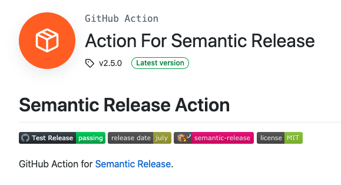

In this post, I'll run through configuring the Semantic Release GitHub Action to automation versioning, creating GitHub Releases, and documenting release notes.

As I started writing this, it occurred to me that there might be two types of folks reading this.
- One set who just want the answers to the test
- One that wants to understand what is going on.

If you're in the first camp, you can just read the **TL;DR** section below.

If you're in the second camp... well I guess you can just read the whole thing. The **[What's going on here?](#whats-going-on-here)** section will have the more detailed explanation of the configurations from the **TL;DR** section.

# TL;DR
---

## Step 1: Configuration

Create a `.releaserc.json` file in the root directory of your repository.

Then, put this in it:

```json
{
    "branch": "master",
    "plugins": [
        [
            "@semantic-release/commit-analyzer",
            {
                "preset": "eslint",
                "releaseRules": [
                    { "tag": "Breaking", "release": "major" },
                    { "tag": "Build", "release": "minor" },
                    { "tag": "Chore", "release": "minor" },
                    { "tag": "Fix", "release": "patch" },
                    { "tag": "New", "release": "minor" },
                    { "tag": "Update", "release": "minor" },
                    { "tag": "Upgrade", "release": "minor" }
                ]
            }
        ],
        [
            "@semantic-release/release-notes-generator",
            {
                "preset": "eslint",
                "releaseRules": [
                    { "tag": "Breaking", "release": "major" },
                    { "tag": "Build", "release": "minor" },
                    { "tag": "Chore", "release": "minor" },
                    { "tag": "Fix", "release": "patch" },
                    { "tag": "New", "release": "minor" },
                    { "tag": "Update", "release": "minor" },
                    { "tag": "Upgrade", "release": "minor" }
                ]
            }
        ],
        [
            "@semantic-release/changelog",
            {
                "changelogFile": "CHANGELOG.md"
            }
        ],
        "@semantic-release/github",
        [
            "@semantic-release/git", {
                "assets": ["package.json", "CHANGELOG.md"],
                "message": "chore(release): ${nextRelease.version} [skip ci]\n\n${nextRelease.notes}"
            }
        ]
    ]
}
```

---
## Step 2: GitHub Actions Workflow

Create a `.github/workflows/release.yml` file.

Then, put this in it:

```yaml
name: Release
on:
  push:
    branches: [ master ]

jobs:
  release:
    runs-on: ubuntu-latest

    steps:
        - name: Checkout
          uses: actions/checkout@v2

        - name: Semantic Release
          uses: cycjimmy/semantic-release-action@v2
          id: semantic
          with:
            extra_plugins: |
              @semantic-release/changelog
              @semantic-release/git
              conventional-changelog-eslint
          env:
            GITHUB_TOKEN: ${{ secrets.GITHUB_TOKEN }}
```

---
## Step 3: Push changes and create a release

Now that things are configured, all you need is for your new commits to follow the `"releaseRules"` that we've specified in the `.releaserc.json` file.

**For example...** 

Let's say we want to commit a new change. Our commit message should follow the format **"New: adds new feature"** where the word **"New"** matches the `{ "tag": "New", "release": "minor" }` release rule.

When we merge the pull request to the main branch, under our current setup the minor version will be incremented (e.g., from `v1.0.0` to `v1.1.0`) 

Similarly, when we commit a fix with a **"Fix: fix bug 123"** commit message, this will match the `{ "tag": "Fix", "release": "patch" }` release rule and will increment the patch version (e.g., from `v1.0.0` to `v1.0.1`)

On top of that, a new release and tag will be created, and because we've also configured the changelog plugin, the CHANGELOG.md file will be updated with release notes based on our commit messages.

And now if we look at the releases in GitHub for the repo, we can see 

---
# What's going on here? 
Let me explain!

Like most things, if you truly want consistency it's better to have a machine do it. 

And we could write scripts to get the current version number then bump the version as new changes get merged to the default branch, but honestly who wants to do that?

Luckily, [semantic-release](https://semantic-release.gitbook.io/semantic-release/) and the [Semantic Release Action](https://github.com/marketplace/actions/action-for-semantic-release) make it pretty damn easy.

---
## ☑️ Requirements

It was important to know what the desired outcome was. For me, there were three main things to accomplish.

1. When changes are merged to the default branch, a new tag should be created with the name being the new version number, along with a GitHub Release. 
2. Semantic Release should analyze my commits and determine whether to bump the major version, the minor version, or the patch version (i.e., `v{major}.{minor}.{patch}` → `v2.0.1`)
3. Semantic Release should also update the [CHANGELOG.md](http://changelog.md) file to keep a history of the release notes.

---
## 🏃 Configuration

Next it was time to start doing, so the plan was to start at the local code / configuration, and work my way towards the remote GitHub repository.

The semantic-release [configuration](https://semantic-release.gitbook.io/semantic-release/usage/configuration) can either go in your *package.json* file, or a separate *.releaserc.json* file.

I decided to keep it in its own file. Hopefully this helps people, or future me, find these configurations more easily.

The `.releaserc.json` file is where you configure the semantic-release plugins, which by default there are four.

- [@semantic-release/commit-analyzer](https://github.com/semantic-release/commit-analyzer)
- [@semantic-release/release-notes-generator](https://github.com/semantic-release/release-notes-generator)
- [@semantic-release/npm](https://github.com/semantic-release/npm)
- [@semantic-release/github](https://github.com/semantic-release/github)

This means that if you have a bare-bones `.releaserc.json` file like this:

```json
{
	"branches": ["master"]
}
```

This is the equivalent of the following:

```json
{
  "branches": ["master"],
	"plugins": [
		"@semantic-release/commit-analyzer",
		"@semantic-release/release-notes-generator",
		"@semantic-release/npm",
		"@semantic-release/github"
	]
}
```

>Note: the **order of the plugins matters**. They will be executed in the order that we have them in the plugins array.

As you might've guessed, or might already know, it's a bit complicated to figure out what the next version should judging by the commits. Hence this list of plugins.

Since I want to do a little extra like update the CHANGELOG file, I need some additional plugins, and since I'm not planning to publish an npm package, I removed the `@semantic-release/npm` plugin.

Specifying the `"plugins"` key in your configuration will overwrite the four default plugins, so you'll likely have to put some of them back in there if you're going to specify it and add your own configurations for one or more of the plugins.

In order to achieve the requirements I outlined above, I used the following semantic-release plugins:

- [@semantic-release/commit-analyzer](https://github.com/semantic-release/commit-analyzer)
- [@semantic-release/release-notes-generator](https://github.com/semantic-release/release-notes-generator)
- [@semantic-release/changelog](https://github.com/semantic-release/changelog)
- [@semantic-release/github](https://github.com/semantic-release/github)
- [@semantic-release/git](https://github.com/semantic-release/git)

Each of these plugins has its own GitHub repo and needs its own configuration. It sounds like kind of a lot, but it's not that bad.

---
## [@semantic-release/commit-analyzer](https://github.com/semantic-release/commit-analyzer)

First, the commit-analyzer.

I needed to specify a `"preset"` and the `"releaseRules"` for that preset.

```json
{
    "branch": "master",
    "plugins": [
        [
            "@semantic-release/commit-analyzer",
            {
                "preset": "eslint",
                "releaseRules": [
                    { "tag": "Breaking", "release": "major" },
                    { "tag": "Build", "release": "minor" },
                    { "tag": "Chore", "release": "minor" },
                    { "tag": "Fix", "release": "patch" },
                    { "tag": "New", "release": "minor" },
                    { "tag": "Update", "release": "minor" },
                    { "tag": "Upgrade", "release": "minor" }
                ]
            }
        ],
        ...
    ]
}
```

The `eslint` preset rules require a `"tag"` value to specify the word to look for in the commit message, and it has to be one of those 7-or-so title-cased words, according to the [README](https://github.com/conventional-changelog/conventional-changelog/tree/master/packages/conventional-changelog-eslint) for the eslint preset.

There's actually one more for Docs which I did not include, and which you could include if you want.

---
## [@semantic-release/release-notes-generator](https://github.com/semantic-release/release-notes-generator)

This plugin is for generating the release notes content, and the configuration is exactly the same as the commit-analyzer.

```json
{
    "branch": "master",
    "plugins": [
        ...
        [
            "@semantic-release/release-notes-generator",
            {
                "preset": "eslint",
                "releaseRules": [
                    { "tag": "Breaking", "release": "major" },
                    { "tag": "Build", "release": "minor" },
                    { "tag": "Chore", "release": "minor" },
                    { "tag": "Fix", "release": "patch" },
                    { "tag": "New", "release": "minor" },
                    { "tag": "Update", "release": "minor" },
                    { "tag": "Upgrade", "release": "minor" }
                ]
            }
        ],
        ...
    ]
}
```

---
## [@semantic-release/changelog](https://github.com/semantic-release/changelog)

This plugin is for updating the `CHANGELOG.md` file with the release notes.

```json
{
    "branch": "master",
    "plugins": [
        ...
        [
            "@semantic-release/changelog",
            {
                "changelogFile": "CHANGELOG.md"
            }
        ],
        ...
    ]
}
```
>**Note**: the value for `changelogFile` is a path to the file which will contain the release notes, which by convention is the CHANGELOG.md file.
---
## [@semantic-release/github](https://github.com/semantic-release/github)

This plugin is for creating the GitHub "Release."

```json
{
    "branch": "master",
    "plugins": [
        ...
        "@semantic-release/github",
        ...
    ]
}
```
I didn't need to add any configuration for this one, so it can simply be added to the `"plugins"` array as a string, rather than a list.

---
## [@semantic-release/git](https://github.com/semantic-release/git)

This plugin is needed to add a release commit for the changes to the CHANGELOG.md file.

```json
{
    "branch": "master",
    "plugins": [
        ...
        [
            "@semantic-release/git", {
                "assets": ["package.json", "CHANGELOG.md"],
                "message": "chore(release): ${nextRelease.version} [skip ci]\n\n${nextRelease.notes}"
            }
        ]
        ...
    ]
}
```
I also included the `"package.json"` file hoping that its version would also be updated, but no dice. If anyone knows why that is, hit me up! Lol.

---
# GitHub Actions

Phew! 😅

That should explain all the configuration. Now for the GitHub Actions release job!



The steps on the marketplace page *Usage* section for the Semantic Release Action are pretty straightforward and they seem to work.

1. Add semantic-release configuration either to your package.json or a .releaserc.json file
2. Make sure you have the required auth tokens accessible as environment variables. For my purposes, since I'm not publishing an NPM package, I only need the `GITHUB_TOKEN` which is already exposed to GitHub Actions workflows via `${{ secrets.GITHUB_TOKEN }}`
3. Create a GitHub Actions workflow yaml file in your repository. The example has the following:

    ```yaml
    steps:
      - name: Checkout
        uses: actions/checkout@v2
      - name: Semantic Release
        uses: cycjimmy/semantic-release-action@v2
        env:
          GITHUB_TOKEN: ${{ secrets.GITHUB_TOKEN }}
          NPM_TOKEN: ${{ secrets.NPM_TOKEN }}
    ```

Since we are not using the default plugins, we need to update this a bit to the one from the beginning.

```yaml
name: Release
on:
  push:
    branches: [ master ]

jobs:
  release:
    runs-on: ubuntu-latest

    steps:
        - name: Checkout
          uses: actions/checkout@v2

        - name: Semantic Release
          uses: cycjimmy/semantic-release-action@v2
          id: semantic
          with:
            extra_plugins: |
              @semantic-release/changelog
              @semantic-release/git
              conventional-changelog-eslint
          env:
            GITHUB_TOKEN: ${{ secrets.GITHUB_TOKEN }}
```
The only difference here is that I've included the rest of the workflow definition at the top (you cannot just create a file with steps, but I imagine if you're here, you likely already know that). 

But more importantly, I added the `with` keyword with the `extra_plugins` to list the non-default plugins I've configured in the `.releaserc.json`. You'll also notice that `conventional-changelog-eslint` is listed in the extra_plugins. This is needed because I've used the `eslint` preset for a couple of the plugins, which defines the `releaseRules` we can use.

This is a feature of the *Semantic Release Action* GitHub Action.

Also worth noting is that I didn't include the `NPM_TOKEN` variable in then `env` values since I'm not publishing an NPM package.

And... that's about it! ✨

This GitHub Action is awesome because it does all the work. We don't have to even include semantic-release as a dependency, or write any custom jobs that run semantic-release to do the versioning. The GitHub action just needs our configuration and then says, "I'll take it from here."

# Link

- [Semantic Release - Usage - Configuration](https://semantic-release.gitbook.io/semantic-release/usage/configuration)

- [Action For Semantic Release - GitHub Marketplace](https://github.com/marketplace/actions/action-for-semantic-release)

- [@semantic-release/commit-analyzer](https://github.com/semantic-release/commit-analyzer)
- [@semantic-release/release-notes-generator](https://github.com/semantic-release/release-notes-generator)
- [@semantic-release/changelog](https://github.com/semantic-release/changelog)
- [@semantic-release/github](https://github.com/semantic-release/github)
- [@semantic-release/git](https://github.com/semantic-release/git)
- [conventional-changelog-eslint](https://github.com/conventional-changelog/conventional-changelog/tree/master/packages/conventional-changelog-eslint)